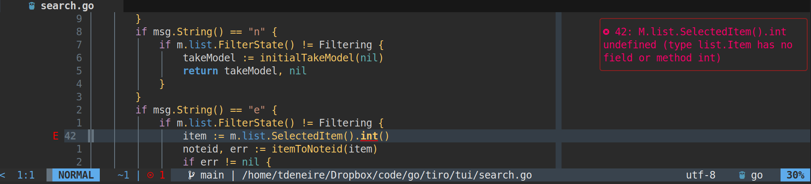

# notify-diagnostics

**This plugin is currently in its alpha stage, so please let me know if you experience any issues!**

## Motivation

`notify-diagnostics` is a Neovim plugin that displays LSP diagnostics with [nvim-notify](https://github.com/rcarriga/nvim-notify).

The prime motivation for this plugin is the fact that the inline "virtual-text" display of the built-in LSP diagnostics sometimes exceeds the available screenwidth of your screen, thus making part of the message illegible. Like so:


With `notify-diagnostics` the message is not only fully legible, but also nicely displayed:



## Configuration

The plugin can be configured in several ways.

### Functionality

- You can configure which diagnostics are displayed (e.g. only errors).
- You can exclude certain error codes (e.g. E501 - line too long).
- You can determine which events (e.g. `BufWritePost`) trigger a notification refresh.
- You can set a timeout for the notication to 

### Appearance

You can make use of the layout options for `nvim-notify` to determine:

- notification title
- rendering style (e.g. minimal) 
- animation (e.g. slide)
- timeout

See below "default settings", for the full list of options and/or consult `h: notify.Options`.

## Installation

(Be advised that this plugin needs `rcarriga/nvim-notify` to be installed.

With Lazy package manager:

```lua
return {
    'tomdeneire/notify-diagnostics.nvim',
    event = { "BufReadPost", "BufNewFile" },
    dependencies = { 'rcarriga/nvim-notify' },
    branch = "main",
    config = function()
        local max_width = math.floor(vim.o.columns * 0.25)
        require("notify-diagnostics").setup({max_width = max_width})
        require("notify").setup({ max_width = max_width })
    end
}
```


## Default settings

`notify-diagnostics` comes with the following defaults, which you can alter during setup:

``` lua
    {
        exclude_codes = {}, -- e.g. {E501 = true}
        max_width = math.floor(vim.o.columns * 0.25),
        severity_levels = {
            info = false,
            hint = false,
            warn = true,
            error = true },
        notify_options = {
            title = "LSP diagnostics",
            render = "minimal", -- "default", "minimal", "simple", "compact"
            animate = "static", -- "fade_in_slide_out", "fade", "slide", "static"
            timeout = false -- boolean, int
        },
        autocommands = { "BufReadPost", "BufWinEnter", "BufWritePost", "InsertLeave" }
    }
```

Also, many people will want to disable LSP virtual text, to avoid duplicate messages (although you can keep it if you want):


``` lua
vim.diagnostic.config({ virtual_text = false })
```

## Screenshots

## To do

This plugin is still very much in active development. A number of issues remain:

- Getting notification refresh snappier
- Avoiding conflicts with other plugins that use `nvim-notify`
- Configuring custom layout

